# Part 2: AI Concepts Explained

Video: [`10:47:48`](https://www.youtube.com/watch?v=J9BI0jGOds8&t=38868s) to `13:01:38`. **21 terms in 5 stages**, from the chat window you already use to what comes next.

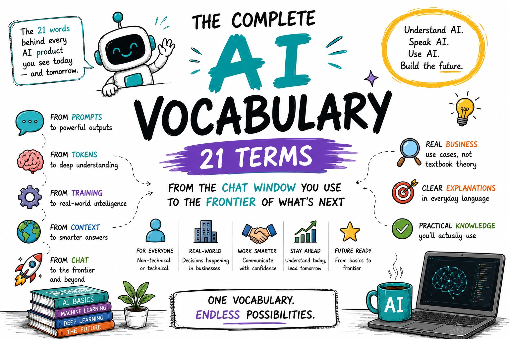

There is no code in this part. The goal is a working vocabulary, so that when someone says *context window*, *RAG* or *MCP* you know what they mean and why it matters. Every term has a card from the course diagram, a short explanation, one hands-on activity, and links to the tools used in the video.

**Study materials**

- [`ai-terms-explained.pdf`](ai-terms-explained.pdf): the full diagram from the video
- [AI Terms Explained (interactive site)](https://ai-terms-explained.netlify.app): the interactive version
- [Quiz](#quiz): twelve questions to test yourself

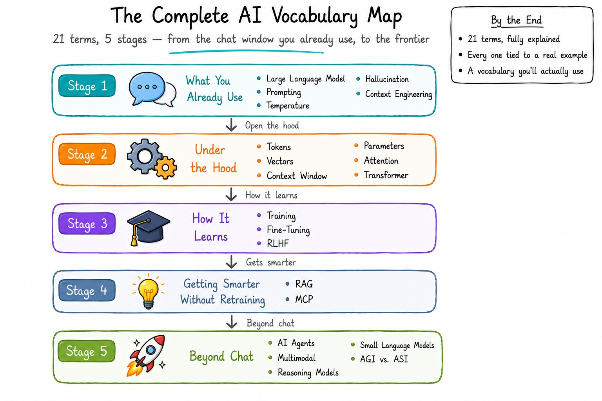

## Contents

**Stage 1: What You Already Use**  
[Large Language Model (LLM)](#large-language-model-llm) · [Prompting](#prompting) · [Temperature](#temperature) · [Hallucination](#hallucination) · [Context Engineering](#context-engineering)

**Stage 2: Under the Hood**  
[Tokens](#tokens) · [Vectors & Embeddings](#vectors--embeddings) · [Context Window](#context-window) · [Model Parameters](#model-parameters) · [Attention Mechanism](#attention-mechanism) · [Transformer](#transformer)

**Stage 3: How It Learns**  
[Pretraining](#pretraining) · [Fine-Tuning](#fine-tuning) · [RLHF](#rlhf)

**Stage 4: Getting Smarter Without Retraining**  
[RAG: Retrieval-Augmented Generation](#rag-retrieval-augmented-generation) · [MCP: Model Context Protocol](#mcp-model-context-protocol)

**Stage 5: Beyond Chat**  
[AI Agents](#ai-agents) · [Multimodal AI](#multimodal-ai) · [Reasoning Models](#reasoning-models) · [Small Language Models](#small-language-models) · [AGI vs ASI](#agi-vs-asi) · [Recap: How It All Connects](#recap-how-it-all-connects)

**Also:** [Resources explained](#resources-explained) · [Quiz](#quiz)

---

## Stage 1: What You Already Use

*The words you meet the moment you open a chat window.*

### Large Language Model (LLM)

[`10:52:08`](https://www.youtube.com/watch?v=J9BI0jGOds8&t=39128s) · *A next-word predictor wearing the costume of understanding.*

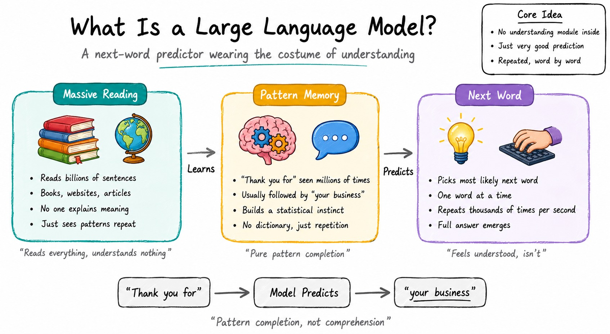

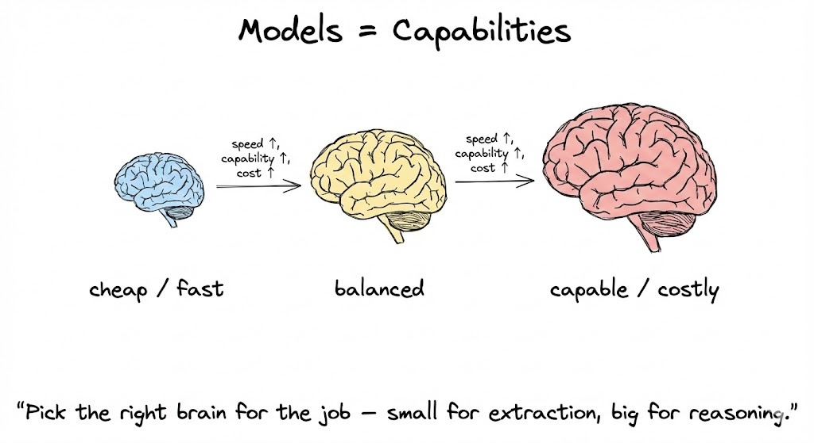

An LLM is trained on enormous amounts of text to predict the most likely next word (strictly, the next token), one step at a time. It does not look facts up in a dictionary: it has absorbed statistical patterns of language so well that its output reads like understanding.

- Learns patterns from massive reading: books, websites, articles.
- "Thank you for ..." is followed by "your business" because it has seen that pattern millions of times.
- Models come in sizes: small and fast and cheap, balanced, or large and capable but costly. Pick the right brain for the job: small for extraction, big for reasoning.

**Try it:** Start a new chat and type "Thank you for". Ask the model to continue it five times. Note how often you get the same ending, then think about why.

**Resources:** [OpenAI: Previewing GPT-5.6](https://openai.com/index/previewing-gpt-5-6-sol/) · [AI Terms Explained (interactive site)](https://ai-terms-explained.netlify.app)

### Prompting

[`10:58:07`](https://www.youtube.com/watch?v=J9BI0jGOds8&t=39487s) · *A couple of examples beats a paragraph of instructions.*

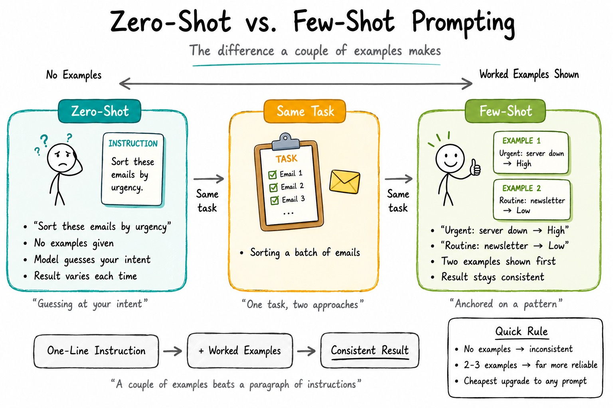

A prompt is the input you give the model. Zero-shot prompting gives only an instruction. Few-shot prompting adds a handful of worked examples, which anchors the model to the pattern and format you want.

- Zero-shot: instruction only, the model guesses your intent.
- Few-shot: instruction plus 2-3 examples gives more consistent results.
- Adding examples is the cheapest upgrade to almost any prompt.

**Try it:** Ask a chatbot to sort five made-up emails by urgency using only an instruction. Then add two worked examples to the same prompt and compare how consistent the answers are.

**Resources:** [Prompt & Context Engineering (interactive)](https://prompt-context-with-mayank.netlify.app/)

### Temperature

[`11:01:57`](https://www.youtube.com/watch?v=J9BI0jGOds8&t=39717s) · *Safe dish or something new?*

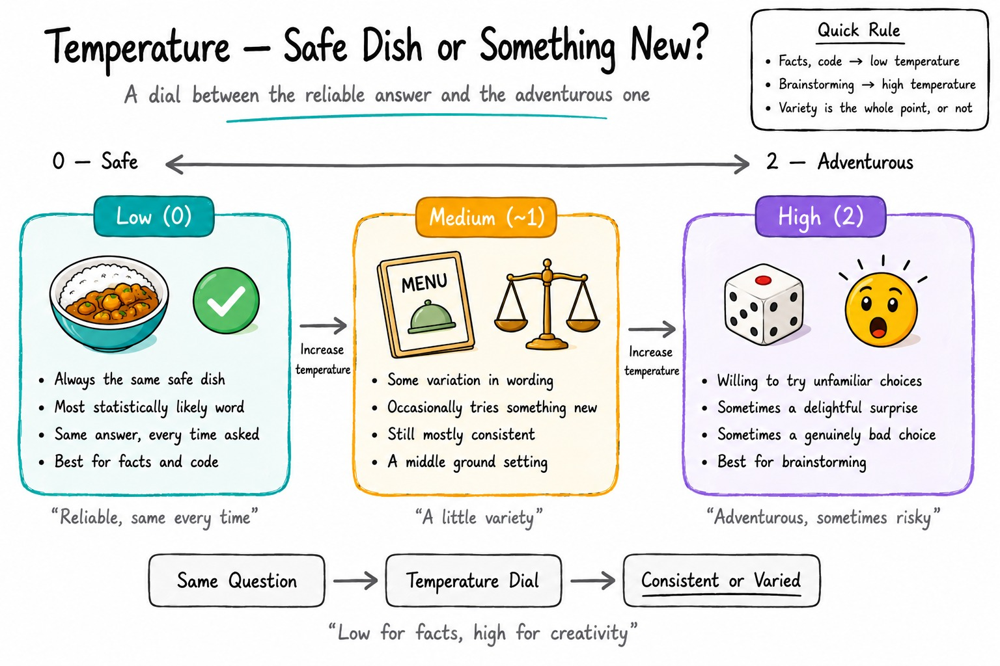

Temperature controls how adventurous the next-word choice is. Low values pick the most probable word almost every time; high values sample more widely, giving variety (and more risk).

- Low (near 0): reliable, repeatable. Best for facts, extraction and code.
- Medium: a little variety, still mostly consistent.
- High: creative and surprising, sometimes off the rails. Best for brainstorming.

**Try it:** Open the visualizer, set temperature low and then high, and watch how the bar for the top word changes. Which setting would you pick for a tax calculation, and which for a poem?

**Resources:** [Temperature & Top-K Visualizer](https://andreban.github.io/temperature-topk-visualizer/)

### Hallucination

[`11:07:43`](https://www.youtube.com/watch?v=J9BI0jGOds8&t=40063s) · *A guess wearing a fact's costume.*

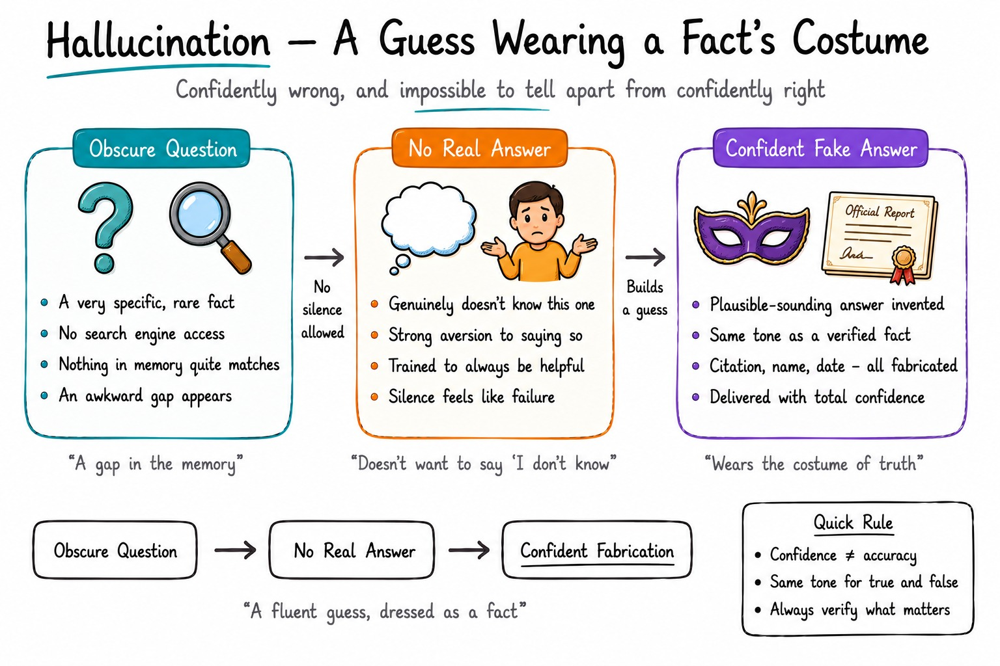

When a model has no real answer (an obscure question, missing knowledge) it still produces fluent text, because its job is to continue the pattern, not to say "I don't know". The result can be confidently wrong and hard to tell apart from a correct answer.

- Confidence is not accuracy: citations, dates and figures can all be invented.
- Mitigate with grounding (RAG), asking for sources, lower temperature, and always verifying.
- Real-world case: an airline was held responsible for a refund policy its chatbot invented.

**Try it:** Ask a chatbot to summarise a book or paper you invented. Then ask for sources and try to verify one. What gave the fabrication away?

**Resources:** [Ars Technica: Air Canada must honor refund policy invented by airline's chatbot](https://arstechnica.com/tech-policy/2024/02/air-canada-must-honor-refund-policy-invented-by-airlines-chatbot/)

### Context Engineering

[`11:12:19`](https://www.youtube.com/watch?v=J9BI0jGOds8&t=40339s) · *Everything on the table before you open your mouth.*

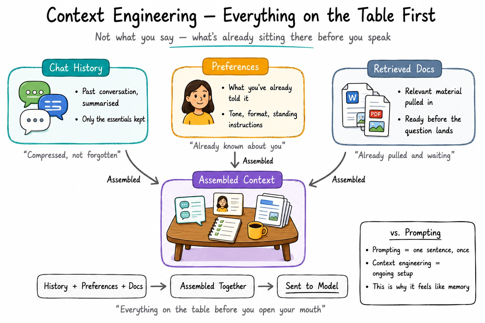

Prompting is what you type. Context engineering is everything already in front of the model when it answers: chat history, your preferences, retrieved documents and tool results, assembled and trimmed deliberately.

- Chat history (summarised, not forgotten), preferences, retrieved docs.
- Prompt: one instruction. Context: the whole setup around it.
- Why the same question can get very different answers in different apps.

**Try it:** List five things a model would need to know to "plan my week" well (calendar, priorities, preferences...). Run the request once with none of them and once with all five.

**Resources:** [Prompt & Context Engineering (interactive)](https://prompt-context-with-mayank.netlify.app/)

---

## Stage 2: Under the Hood

*What actually happens to your words inside the model.*

### Tokens

[`11:17:22`](https://www.youtube.com/watch?v=J9BI0jGOds8&t=40642s) · *Puzzle pieces of words.*

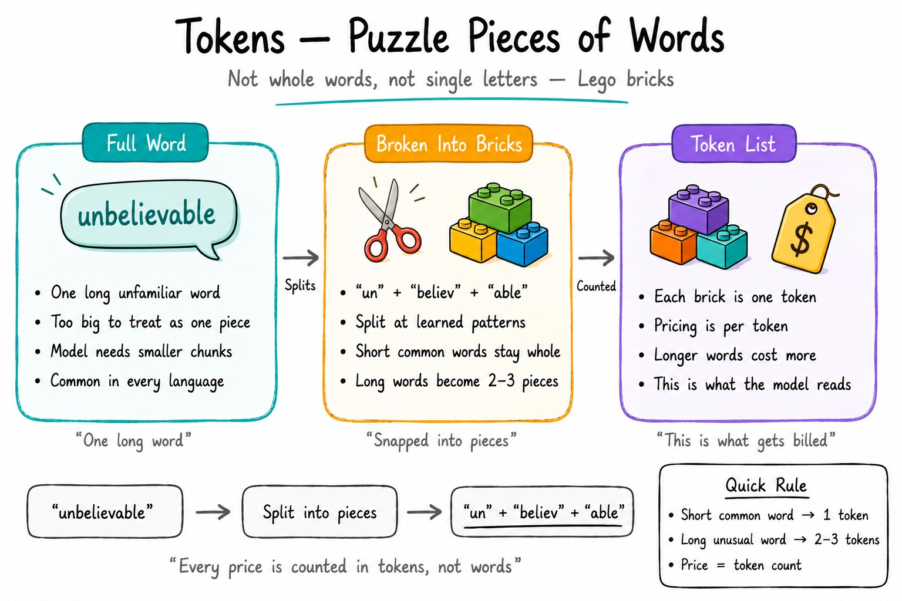

Models do not read letters or whole words; they read tokens, the chunks a tokenizer splits text into. Common words are often one token, rare or long words become several. Pricing, speed and limits are all counted in tokens.

- "unbelievable" might split into un + believe + able.
- API cost = tokens in + tokens out.
- Try it: paste any text into the tokenizer and watch it split.

**Try it:** Paste a long word, an English sentence and the same sentence in another language into the tokenizer. Compare the token counts and think about what that means for cost.

**Resources:** [OpenAI Tokenizer](https://platform.openai.com/tokenizer)

### Vectors & Embeddings

[`11:26:22`](https://www.youtube.com/watch?v=J9BI0jGOds8&t=41182s) · *A GPS coordinate for meaning.*

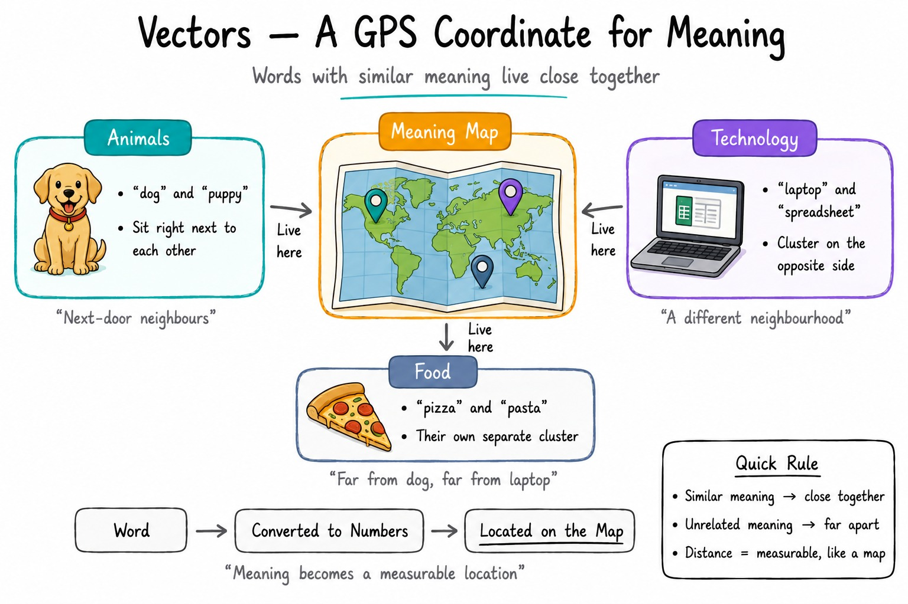

Each token is converted into a vector (a long list of numbers) called an embedding. Words with similar meaning end up close together, so meaning becomes measurable distance. This is why "apple" the fruit and "Apple" the company land in different neighbourhoods depending on context.

- dog and puppy sit next to each other; laptop and spreadsheet cluster together.
- Similarity search over embeddings powers RAG and semantic search.

**Try it:** On paper, place these words on a map so related ones sit close together: dog, puppy, laptop, spreadsheet, pizza, pasta, apple, iPhone. Where does "apple" end up, and why is that hard?

### Context Window

[`11:31:37`](https://www.youtube.com/watch?v=J9BI0jGOds8&t=41497s) · *A whiteboard with limited space.*

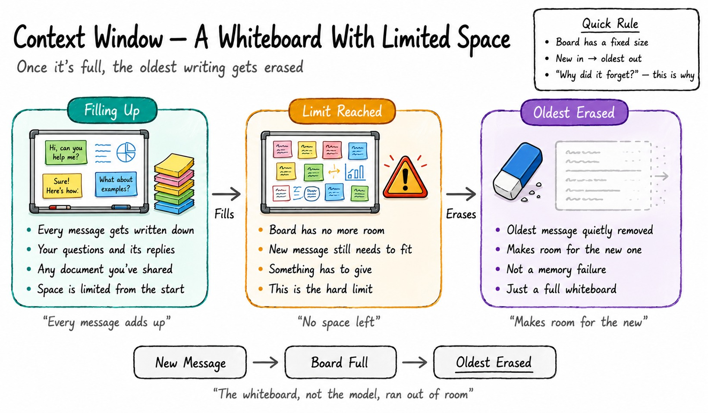

The context window is the maximum number of tokens a model can consider at once: your prompt, the chat so far, documents and its own reply. When it is full, the oldest content is dropped.

- Every message adds up; the model has no memory beyond what fits on the board.
- Bigger windows allow longer documents but cost more and can dilute focus.

**Try it:** A page of English text is roughly 400 to 500 tokens. Estimate whether a 30-page report would fit in an 8,000-token window.

### Model Parameters

[`11:39:49`](https://www.youtube.com/watch?v=J9BI0jGOds8&t=41989s) · *Billions of tiny sliders.*

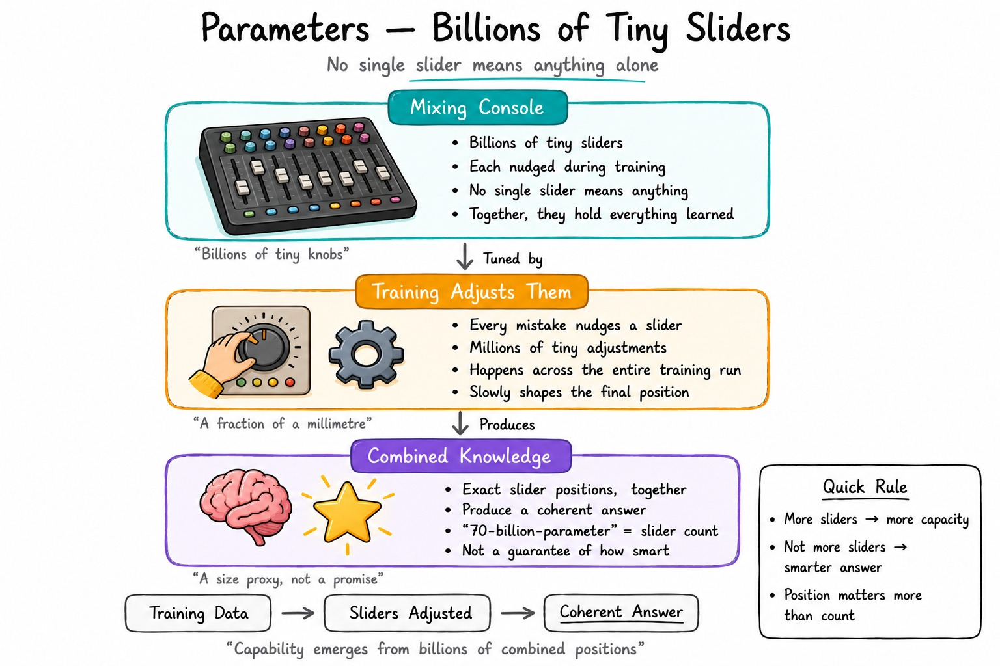

Parameters (weights) are the numbers inside the network that training adjusts. No single one means anything; together they encode everything the model has learned. "70B" means seventy billion of them.

- More parameters usually means more capacity, not automatically more intelligence.
- Training nudges every slider a tiny bit, millions of times.

**Try it:** Look up the parameter counts of three open models. Rank them, then check whether the biggest is also the best at your task.

### Attention Mechanism

[`11:46:56`](https://www.youtube.com/watch?v=J9BI0jGOds8&t=42416s) · *Leaning on neighbouring words.*

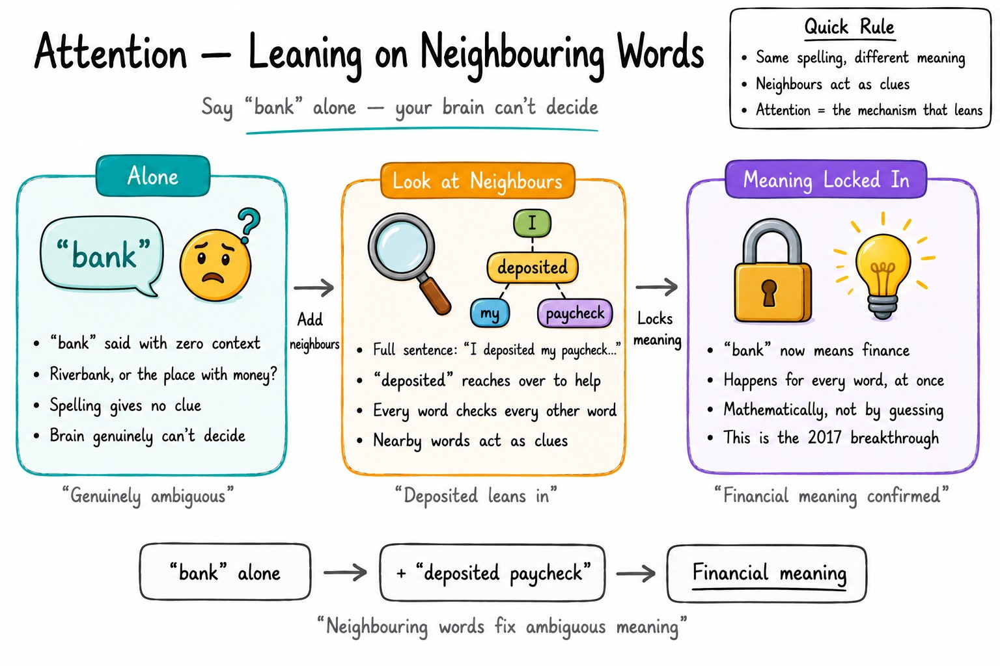

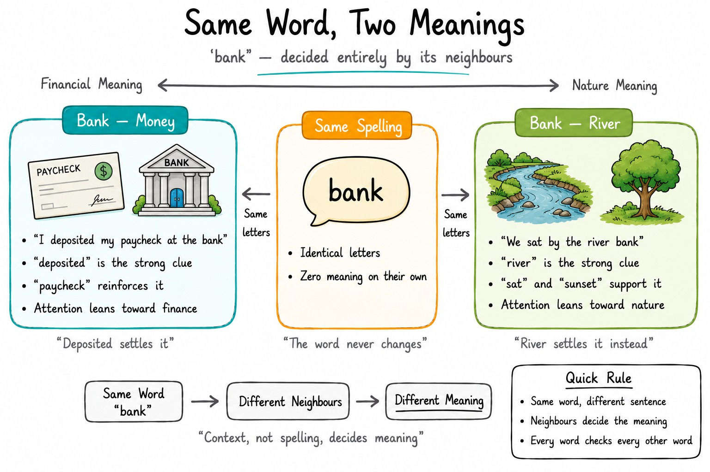

To interpret a word, the model weighs how much each other word in the sentence matters to it. "Bank" next to "deposited" and "paycheck" means money; next to "river" it means a riverbank.

- Same spelling, different meaning, decided by the neighbours.
- Every token looks at every other token and decides what to focus on.

**Try it:** In Transformer Explainer type `The bank of the river` and then `The bank approved my loan`. Hover over `bank` each time and compare which words get the most attention.

**Resources:** [Transformer Explainer (Polo Club)](https://poloclub.github.io/transformer-explainer/)

### Transformer

[`11:52:46`](https://www.youtube.com/watch?v=J9BI0jGOds8&t=42766s) · *The engine, not the car.*

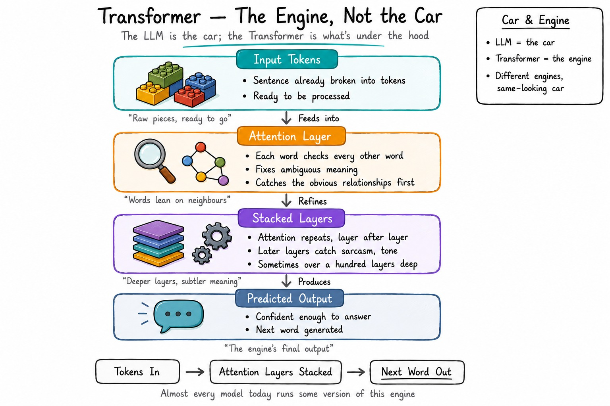

The Transformer is the neural-network architecture (introduced in 2017) that stacks attention layers. The LLM is the car; the Transformer is the engine under the hood. Other architectures can generate text too, but nearly every major model today uses a variant of this one.

- Tokens in, many attention layers, next-word prediction out.
- LLM generates the next word; the Transformer is one way (not the only way) to do it.

**Try it:** In Transformer Explainer, find the three stages (embedding, transformer blocks, output probabilities) and point to where the next word is chosen.

**Resources:** [Transformer Explainer (Polo Club)](https://poloclub.github.io/transformer-explainer/)

---

## Stage 3: How It Learns

*How a model goes from random numbers to something useful.*

### Pretraining

[`12:04:37`](https://www.youtube.com/watch?v=J9BI0jGOds8&t=43477s) · *Millions of fill-in-the-blank quizzes.*

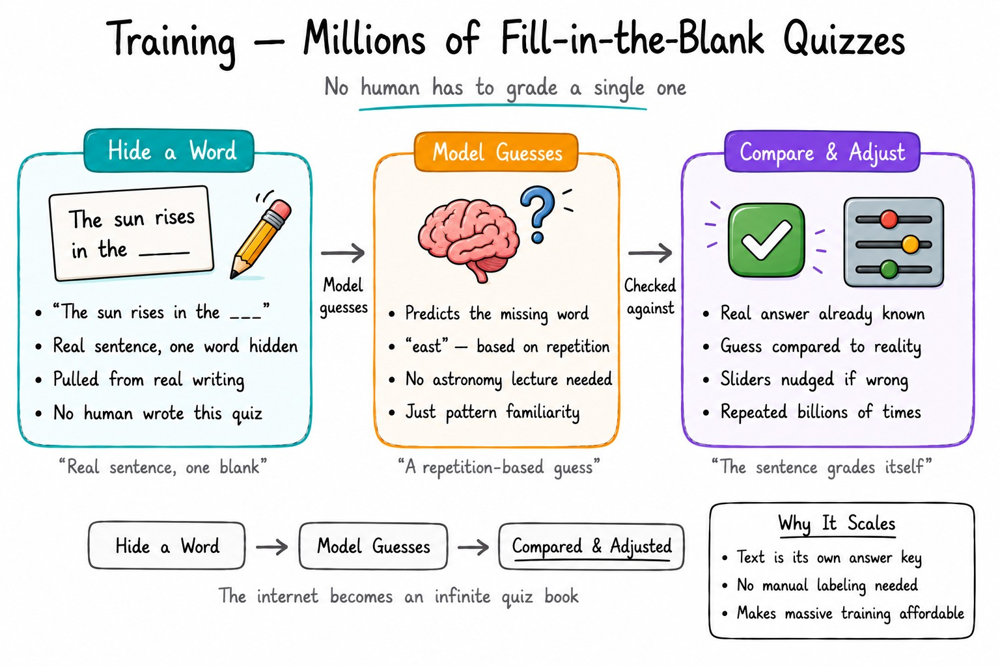

Pretraining hides a word in real text, asks the model to guess it, then compares with the truth and adjusts the parameters. Because the text supplies its own answer key, no human has to grade anything, which is why it scales to internet-sized data.

- Hide a word, guess, compare, adjust, repeat billions of times.
- Produces a base model that is knowledgeable but not yet a helpful assistant.

**Try it:** Take five sentences from a book, hide one word in each and ask a friend to guess. You have just done pretraining by hand.

### Fine-Tuning

[`12:08:10`](https://www.youtube.com/watch?v=J9BI0jGOds8&t=43690s) · *A residency after a general degree.*

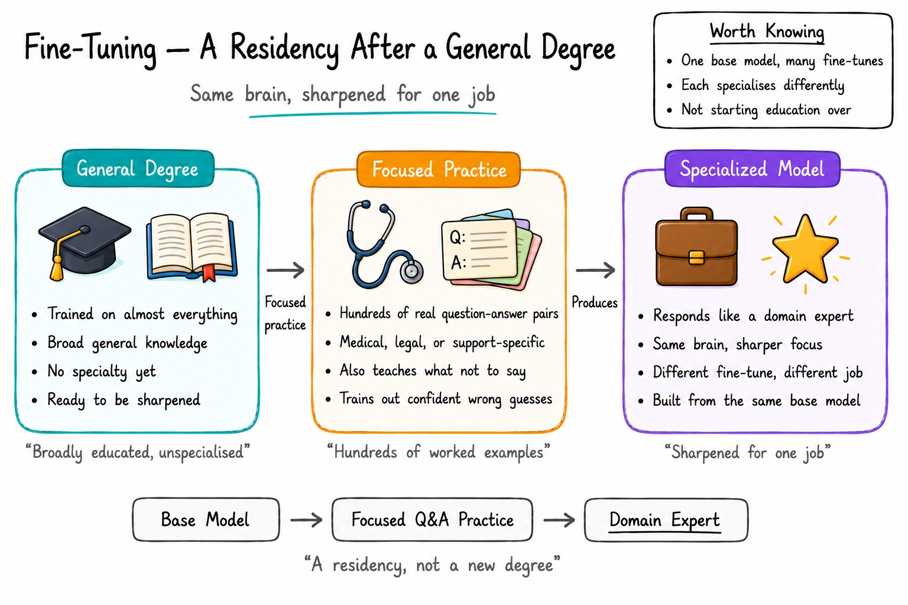

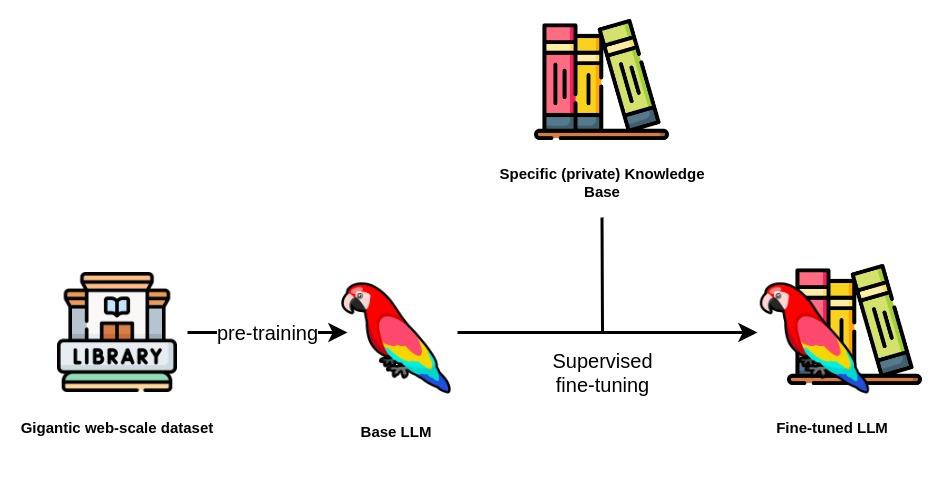

Fine-tuning continues training a base model on a smaller, focused set of examples so it specialises: medical Q&A, legal drafting, a company's support style. One base model can have many fine-tuned variants.

- Base model + focused practice = domain expert.
- Teaches style and behaviour; it is not the best way to add fresh facts (see RAG).

**Try it:** Write five question and answer pairs you would use to turn a general model into a support agent for a product you know.

### RLHF

[`12:11:31`](https://www.youtube.com/watch?v=J9BI0jGOds8&t=43891s) · *Training a puppy, at model scale.*

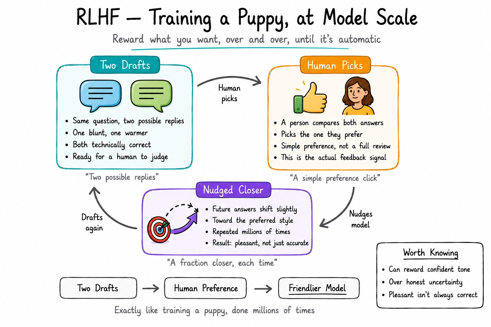

Reinforcement Learning from Human Feedback: the model produces two drafts, a person picks the better one, and the model is nudged toward preferred answers. Repeated at scale, it makes assistants more helpful, polite and safe.

- Humans express preference, not corrections.
- Makes answers pleasant, which is not the same as always correct.

**Try it:** Ask a chatbot the same question twice with different wording, pick the better answer, and write down your criteria. Those criteria are what RLHF tries to learn.

---

## Stage 4: Getting Smarter Without Retraining

*Giving a model fresh knowledge and real tools at question time.*

### RAG: Retrieval-Augmented Generation

[`12:16:08`](https://www.youtube.com/watch?v=J9BI0jGOds8&t=44168s) · *Closed-book exam vs open-book exam.*

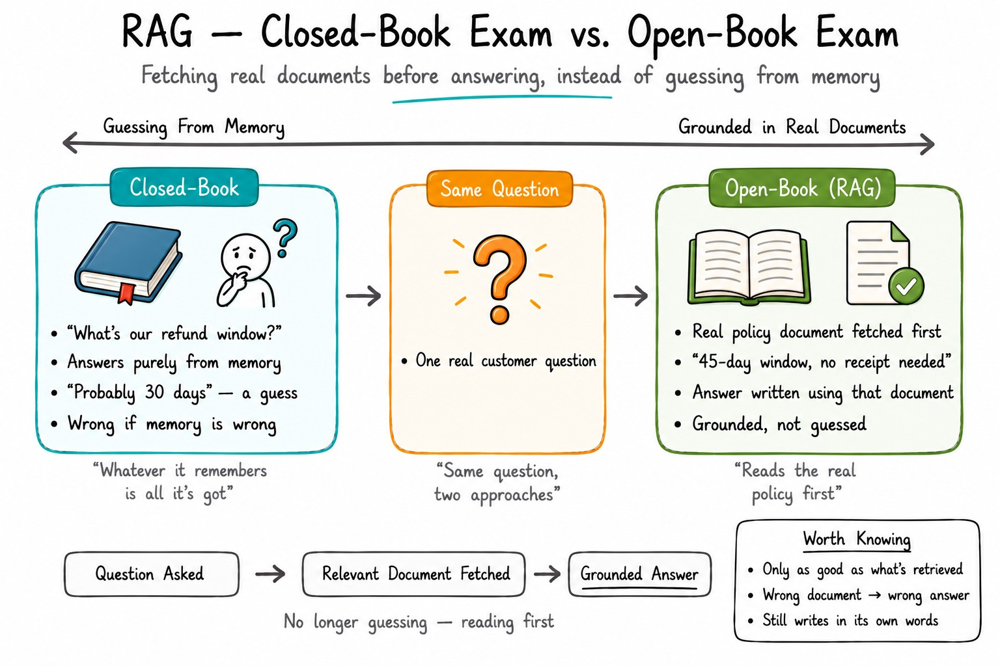

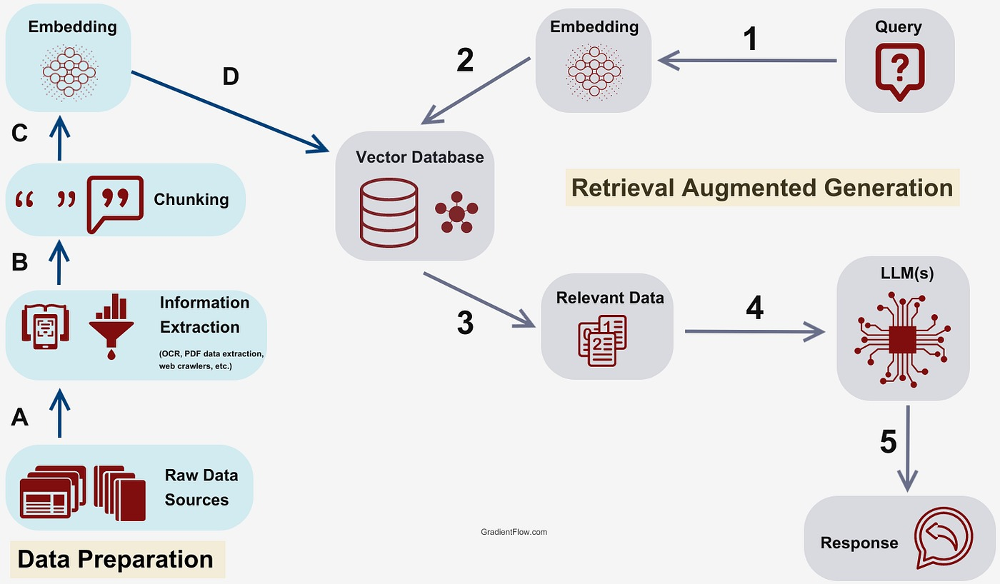

Instead of answering from memory, the system first retrieves relevant documents (company docs, HR policies) and hands them to the model with the question, so the answer is grounded in real text. Retrieval typically uses embeddings stored in a vector database.

- Pipeline: prepare data (extract, chunk, embed) then embed the query, retrieve, generate.
- Only as good as what is retrieved: wrong document in, wrong answer out.
- Reduces hallucination and works with private, up-to-date data without retraining.

**Try it:** Pick a policy document. Write three questions about it and underline the sentence that answers each one. Finding that sentence is the retrieval step.

### MCP: Model Context Protocol

[`12:26:47`](https://www.youtube.com/watch?v=J9BI0jGOds8&t=44807s) · *One universal port, like USB-C for AI.*

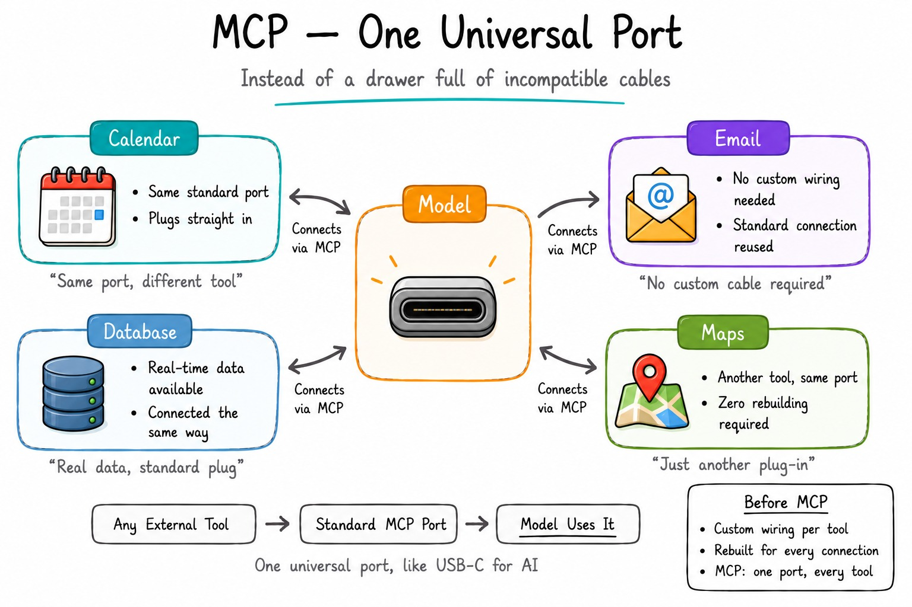

MCP is an open standard for connecting AI applications to external tools and data. Instead of every app writing custom glue for every service (Gmail, calendar, database), a service exposes an MCP server once and any MCP-capable client can use its tools, resources and prompts.

- Before MCP: custom wiring per app per tool. After: one standard connection.
- Example: a Gmail MCP server offers send, draft and read email tools to Claude, Cursor, VS Code and others.
- MCP servers expose three things: tools, resources and prompts.

**Try it:** Choose three apps you use daily (email, calendar, notes). For each, list the tools an MCP server would expose, such as "read", "create" and "search".

---

## Stage 5: Beyond Chat

*Where AI is heading: agents, other senses, deeper thinking, and big ideas.*

### AI Agents

[`12:38:47`](https://www.youtube.com/watch?v=J9BI0jGOds8&t=45527s) · *Perceive, reason, act, observe.*

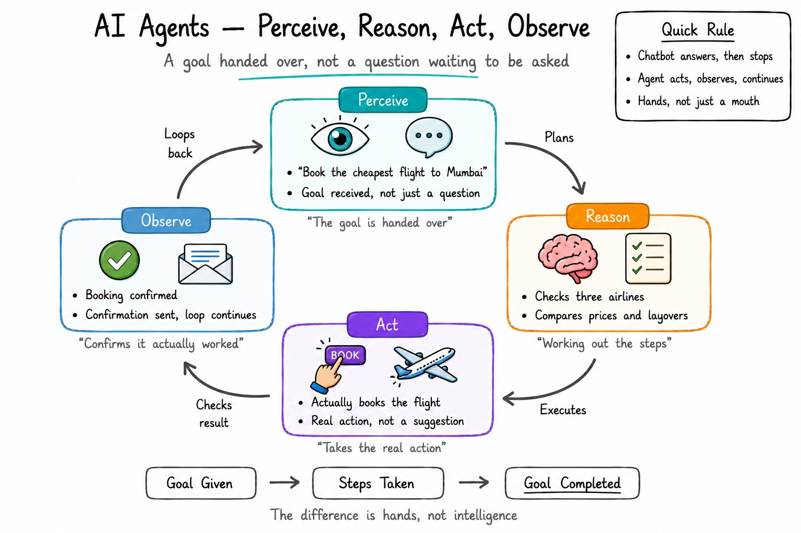

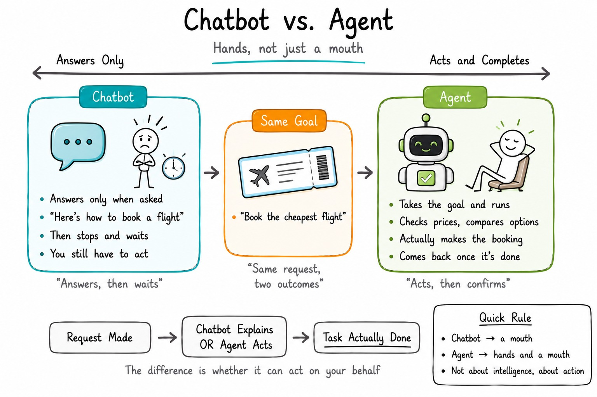

A chatbot answers and waits. An agent is handed a goal and works toward it in a loop: understand the situation, plan, use tools to act, check the result, and continue until done. Model plus memory plus tools.

- Loop: perceive, reason, act, observe.
- "Book the cheapest flight": chatbot explains how; agent actually books it.
- The difference is hands, not intelligence.

**Try it:** Pick the goal "tidy my inbox". Write two turns of the loop: what the agent perceives, what it reasons, which tool it acts with and how it checks the result.

### Multimodal AI

[`12:45:49`](https://www.youtube.com/watch?v=J9BI0jGOds8&t=45949s) · *More than one sense.*

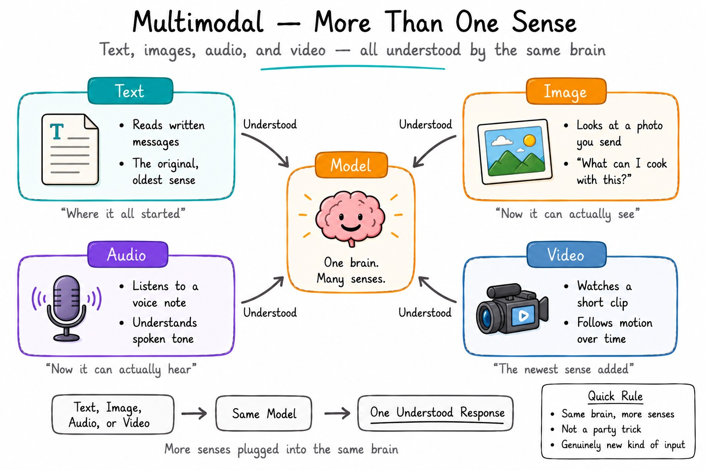

A multimodal model handles several kinds of input and sometimes output (text, images, audio, video) in one system, so you can show it a photo, speak to it, or have it watch a clip.

- One brain, many senses.
- Not a party trick: a genuinely different kind of input.

**Try it:** Take a photo of your fridge or desk, send it to a multimodal model and ask for a recipe or a cleanup plan. Which parts did it get right?

### Reasoning Models

[`12:48:15`](https://www.youtube.com/watch?v=J9BI0jGOds8&t=46095s) · *Thinking it through first.*

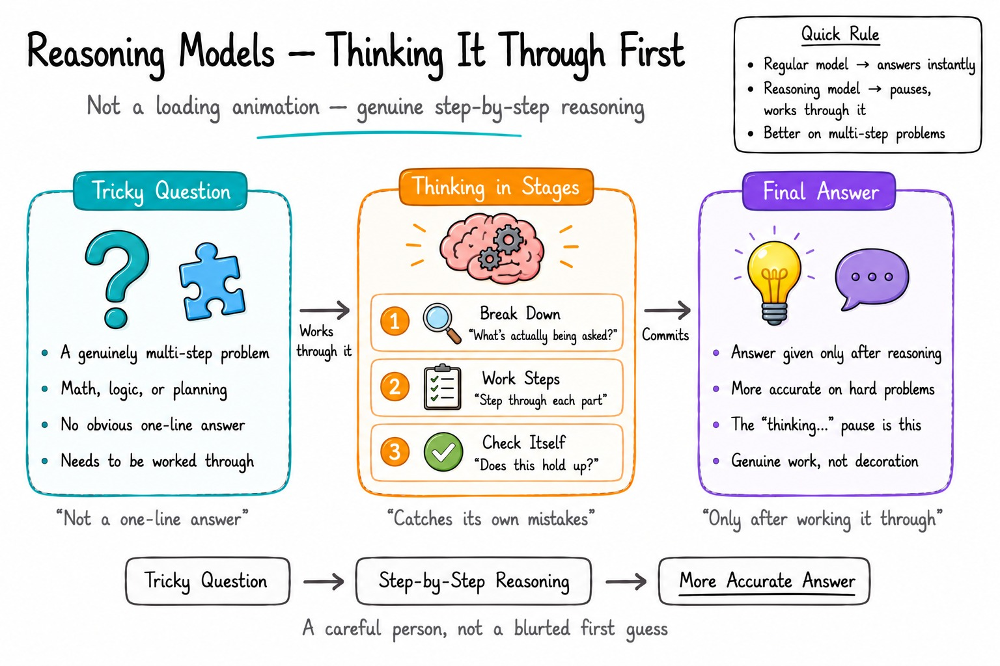

Reasoning models spend extra computation working through a problem step by step (break it down, work each step, check themselves) before giving a final answer. Slower and costlier, but better at multi-step maths, logic and planning.

- Regular model answers instantly; reasoning model pauses and works it out.
- Use for hard multi-step problems, not for simple lookups.

**Try it:** Give the same multi-step maths puzzle to a standard model and a reasoning model. Compare the time taken and the quality of the answer.

### Small Language Models

[`12:52:07`](https://www.youtube.com/watch?v=J9BI0jGOds8&t=46327s) · *A private tutor for a handful of subjects.*

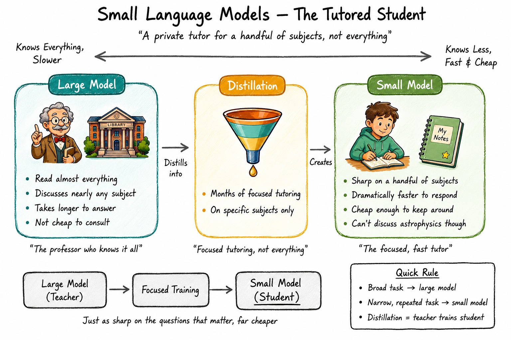

Small language models trade breadth for speed and cost. They are often created by distillation: a large teacher model trains a smaller student on specific tasks. Great for narrow, repeated work, on-device or on a budget.

- Broad task: large model. Narrow, repeated task: small model.
- Distillation: teacher trains student.

**Try it:** Write three tasks that need a large model and three that a small model could handle. What separates the two lists?

### AGI vs ASI

[`12:54:10`](https://www.youtube.com/watch?v=J9BI0jGOds8&t=46450s) · *Narrow today, theoretical tomorrow.*

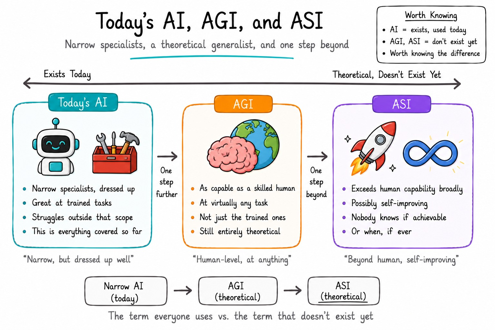

Today's AI is narrow: very good at what it was trained for. AGI (artificial general intelligence) would match a skilled human at virtually any task; ASI (artificial superintelligence) would exceed human ability broadly. Neither exists today, and nobody knows if or when they will.

- AI: exists, used today.
- AGI and ASI: theoretical. Worth knowing the difference.

**Try it:** Write three things humans do easily that today's AI still struggles with. Would solving them require "general" intelligence?

### Recap: How It All Connects

[`12:56:47`](https://www.youtube.com/watch?v=J9BI0jGOds8&t=46607s) · *One message, the whole machine.*

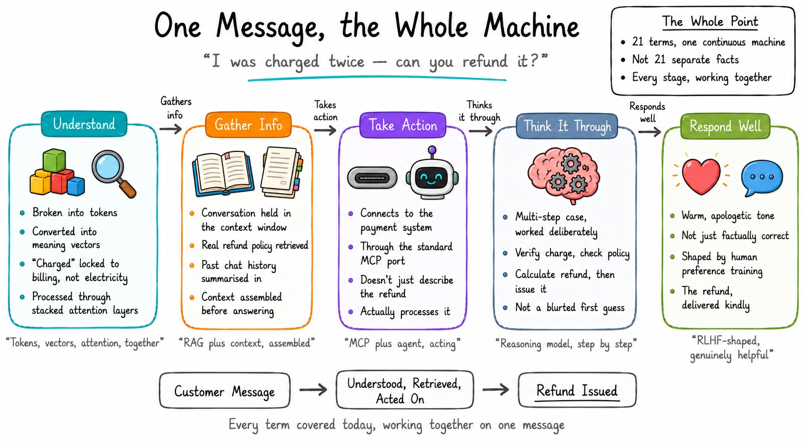

Walk one customer message through every term: "I was charged twice, can you refund it?" The text is broken into tokens and vectors, attention finds the meaning, context and RAG pull in the refund policy and chat history, an agent uses MCP tools to act on the payment system, a reasoning model works through the details, and RLHF-shaped training gives a warm, helpful reply.

**Try it:** Trace a different message through the same machine, for example "Book me the cheapest train to Delhi tomorrow". Which of the 21 terms appear, and in what order?

---

## Final thoughts

[`12:59:03`](https://www.youtube.com/watch?v=J9BI0jGOds8&t=46743s) Final Thoughts: close the loop and decide where to go next.

## Resources explained

Every link used in the video, what it is, and how to get value from it in a few minutes.

### [AI Terms Explained (interactive site)](https://ai-terms-explained.netlify.app)

A glossary site that explains the AI terms from this course in everyday language. Related chapter: [`10:47:48`](https://www.youtube.com/watch?v=J9BI0jGOds8&t=38868s) (All 21 terms).

How to use it:

1. Open the site and pick any term.
2. Read the short explanation first, then compare it with the card in this repo.

### [OpenAI Tokenizer](https://platform.openai.com/tokenizer)

A tool from OpenAI that shows exactly how a piece of text is cut into tokens and how many there are. Related chapter: [`11:17:22`](https://www.youtube.com/watch?v=J9BI0jGOds8&t=40642s) (Tokens).

How to use it:

1. Paste any text into the box.
2. Look at the coloured chunks: each colour is one token.
3. Try a long word, an emoji and a non-English sentence and compare the counts.

### [Temperature & Top-K Visualizer](https://andreban.github.io/temperature-topk-visualizer/)

A visualizer built on real next-word probabilities from a small open model (Gemma 3 1B). It shows the ten most likely next tokens as a chart. Related chapter: [`11:01:57`](https://www.youtube.com/watch?v=J9BI0jGOds8&t=39717s) (Temperature).

How to use it:

1. Move the temperature slider and watch the bars flatten or sharpen.
2. Set top-k to 1 and see that only the best token survives.
3. Try top-p to keep the smallest group of tokens whose probabilities add up to p.

### [Ars Technica: Air Canada must honor refund policy invented by airline's chatbot](https://arstechnica.com/tech-policy/2024/02/air-canada-must-honor-refund-policy-invented-by-airlines-chatbot/)

A news report on a 2024 case where an airline was held to a refund policy that its own chatbot had invented. A real example of why hallucinations matter. Related chapter: [`11:07:43`](https://www.youtube.com/watch?v=J9BI0jGOds8&t=40063s) (Hallucination).

How to use it:

1. Read the article.
2. Ask yourself which of the three fixes (grounding, verification, human review) would have stopped it.

### [Prompt & Context Engineering (interactive)](https://prompt-context-with-mayank.netlify.app/)

Your own companion site, the Prompt Engineering Masterclass: a place to go deeper on writing prompts and building context. Related chapter: [`10:58:07`](https://www.youtube.com/watch?v=J9BI0jGOds8&t=39487s) (Prompting, Context Engineering).

How to use it:

1. Use it after the Prompting and Context Engineering chapters.
2. Apply one idea to a real task you do this week.

### [Transformer Explainer (Polo Club)](https://poloclub.github.io/transformer-explainer/)

An interactive tool that runs a small GPT-2 model right in your browser so you can watch embeddings, attention and next-word probabilities happen live. Related chapter: [`11:52:46`](https://www.youtube.com/watch?v=J9BI0jGOds8&t=42766s) (Attention, Transformer).

How to use it:

1. Type a short sentence and press the generate button.
2. Hover over a token to see which other tokens it pays attention to.
3. Change temperature, top-k and top-p and watch the output probabilities move.

### [OpenAI: Previewing GPT-5.6](https://openai.com/index/previewing-gpt-5-6-sol/)

An OpenAI announcement page linked in the video, useful as an example of how a lab presents a new model. Related chapter: [`10:52:08`](https://www.youtube.com/watch?v=J9BI0jGOds8&t=39128s) (LLMs).

How to use it:

1. Read how the model is described.
2. Spot the terms from Stage 1 and 2 in the announcement (parameters, context window, reasoning).

> Some of these sites block automated link checkers. If a link does not open for you, search for its title.

## Quiz

Try to answer before opening the answer.

<b>1.</b> What does an LLM actually do at each step?

It predicts the next token based on patterns learned during training.

<b>2.</b> Which setting would you lower to get more predictable answers?

Temperature.

<b>3.</b> Why can a confident answer still be wrong?

The model is trained to continue plausible text, not to check facts, so it can hallucinate.

<b>4.</b> What is the difference between a prompt and context?

A prompt is what you type; context is everything the model sees (history, preferences, documents, tool results).

<b>5.</b> Why are tokens important for cost?

Providers price usage per token, both input and output.

<b>6.</b> What does an embedding represent?

A word or token as a list of numbers where similar meanings sit close together.

<b>7.</b> What happens when the context window is full?

The oldest content is dropped (or must be summarised) to make room.

<b>8.</b> Which stage of training uses human preferences?

RLHF.

<b>9.</b> How does RAG reduce hallucination?

It retrieves real documents first and has the model answer from them.

<b>10.</b> What problem does MCP solve?

It gives AI apps one standard way to connect to tools and data, instead of custom wiring for each.

<b>11.</b> What turns a chatbot into an agent?

The ability to act: it loops through perceive, reason, act and observe using tools.

<b>12.</b> Does AGI exist today?

No. Today's AI is narrow; AGI and ASI are still theoretical.

[Course home](../README.md)
